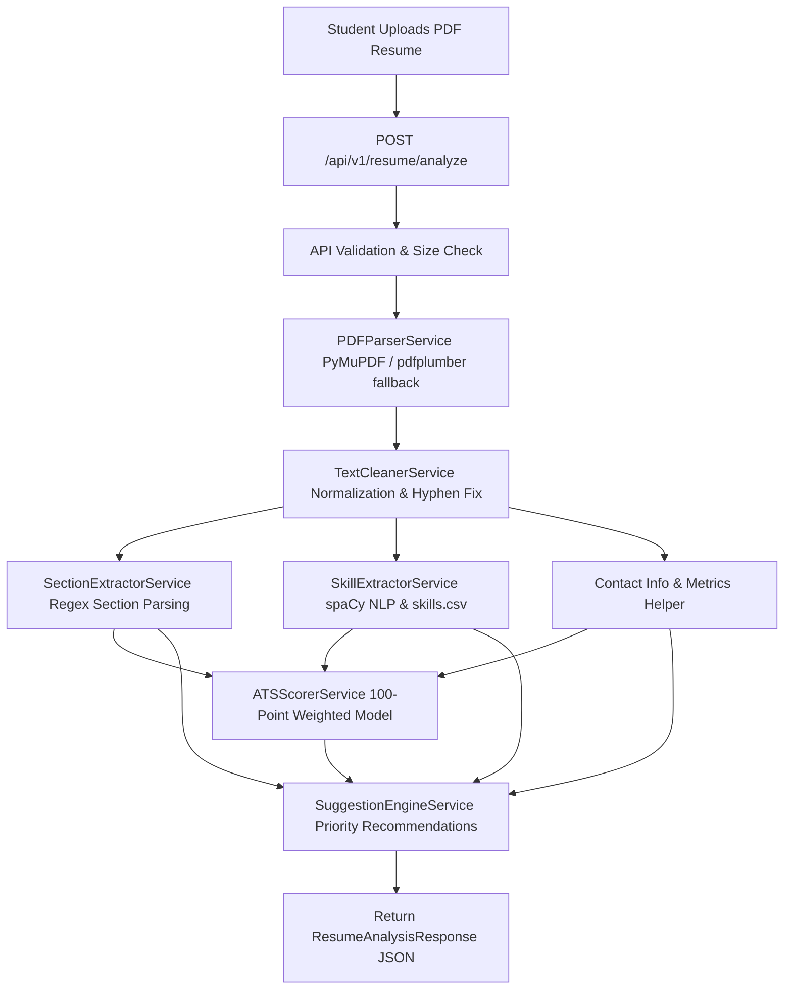

# AI Placement Copilot for Indian Students
## Phase 1: AI Resume Analyzer Backend

[](https://www.python.org/)
[](https://fastapi.tiangolo.com/)
[](https://docs.pydantic.dev/)
[](https://www.python.org/dev/peps/pep-0008/)

---

## 📌 Project Overview

**Phase 1 - AI Resume Analyzer** is an independent, production-ready AI backend module of the **AI Placement Copilot** ecosystem designed specifically for Indian engineering students and fresh graduates preparing for campus placement drives (on-campus and off-campus).

The system accepts student resume PDFs, extracts text with multi-engine fallback (`PyMuPDF` + `pdfplumber`), cleans & normalizes text, parses standard resume sections, matches 150+ categorized technical skills via `spaCy` NLP and alias resolution, calculates an ATS Score (out of 100) using weighted scoring rules, and generates actionable improvement suggestions.

---

## ✨ Features

- **Multi-Engine PDF Parser**: Primary extraction using `PyMuPDF` (`fitz`) with automatic fallback to `pdfplumber`. Handles encrypted, scanned, corrupted, and empty files gracefully.
- **Text Normalization**: Unicode NFKC normalization, hyphenated line-wrap repair, control character stripping, and whitespace sanitization.
- **Section Parsing**: Regex & phrase matcher for detecting standard resume sections (`Education`, `Experience`, `Projects`, `Skills`, `Certifications`, `Achievements`, `Internships`).
- **NLP Skill Extractor**: Powered by `spaCy` `PhraseMatcher` and a taxonomy dataset of 150+ skills across 10 categories with alias resolution (e.g. `ReactJS` → `React`, `JS` → `JavaScript`).
- **Weighted ATS Scoring**: Calculates ATS compatibility out of 100 based on Essential Sections (30%), Technical Skills (30%), Projects & Experience (20%), Contact Information (10%), and Structure/Quality (10%).
- **Actionable Suggestion Engine**: Prioritized (`HIGH`, `MEDIUM`, `LOW`) feedback highlighting missing sections, skill gaps, action verb improvements, and contact details.
- **Production-Ready**: Type hinted, PEP 8 compliant, exception-safe, modular clean architecture designed for future seamless integration.

---

## 🏗️ Architecture Diagram



---

## 📁 Project Folder Structure

```
ai/
└── resume/
    ├── app/
    │   └── __init__.py
    ├── api/
    │   ├── __init__.py
    │   └── resume.py              # Upload & analysis endpoint routes
    ├── services/
    │   ├── __init__.py
    │   ├── pdf_parser.py           # Module 1: PyMuPDF + pdfplumber fallback
    │   ├── text_cleaner.py         # Module 2: Text sanitization & line-wrap fix
    │   ├── section_extractor.py    # Module 3: Regex header detection
    │   ├── skill_extractor.py      # Module 4: spaCy PhraseMatcher & taxonomy lookup
    │   ├── ats_scorer.py           # Module 5: 100-pt weighted scoring
    │   ├── suggestion_engine.py    # Module 6: Actionable recommendation generator
    │   └── resume_pipeline.py     # Module 7: Orchestrating pipeline
    ├── models/
    │   ├── __init__.py
    │   └── resume.py              # Pydantic v2 schemas for request/response
    ├── utils/
    │   ├── __init__.py
    │   ├── logger.py              # Centralized logging & execution timer
    │   ├── constants.py           # Section patterns, action verbs, regexes
    │   ├── exceptions.py          # Custom domain exceptions
    │   └── helpers.py             # Contact extraction & word metrics
    ├── data/
    │   └── skills.csv             # 150+ technical skills taxonomy with aliases
    ├── tests/
    │   ├── __init__.py
    │   ├── conftest.py            # Pytest fixtures & sample PDFs
    │   ├── test_pdf_parser.py
    │   ├── test_text_cleaner.py
    │   ├── test_section_extractor.py
    │   ├── test_skill_extractor.py
    │   ├── test_ats_scorer.py
    │   ├── test_suggestion_engine.py
    │   ├── test_resume_pipeline.py
    │   └── test_api.py
    ├── uploads/                   # Temporary file directory
    ├── config.py                  # Pydantic BaseSettings config
    ├── main.py                    # FastAPI application entry point
    ├── requirements.txt           # Dependency requirements
    ├── .env.example               # Environment variable template
    └── README.md
```

---

## ⚙️ Installation & Setup

### Prerequisites

- **Python 3.12+**
- `pip` package manager

### Step-by-Step Setup

1. **Navigate to project directory:**
   ```bash
   cd ai/resume
   ```

2. **Create and activate virtual environment:**
   ```bash
   python -m venv venv
   # On Windows (PowerShell):
   .\venv\Scripts\Activate.ps1
   # On Linux/macOS:
   source venv/bin/activate
   ```

3. **Install Dependencies:**
   ```bash
   pip install -r requirements.txt
   ```

4. **(Optional) Download spaCy English NLP Model:**
   ```bash
   python -m spacy download en_core_web_sm
   ```
   *(Note: If not pre-downloaded, the backend automatically falls back to `spacy.blank("en")` without breaking).*

5. **Setup Environment Variables:**
   ```bash
   cp .env.example .env
   ```

6. **Run Server:**
   ```bash
   uvicorn main:app --reload --host 0.0.0.0 --port 8000
   ```
   The backend will start at `http://localhost:8000`.

---

## 🌐 API Documentation & Usage

FastAPI generates interactive Swagger docs automatically at:
- **Swagger UI**: `http://localhost:8000/docs`
- **ReDoc**: `http://localhost:8000/redoc`

### Endpoints Summary

| Method | Endpoint | Description |
| :--- | :--- | :--- |
| `GET` | `/health` | Server health check endpoint |
| `POST` | `/api/v1/resume/analyze` | Upload PDF resume for complete analysis |

---

## 💻 Example Request & Response

### Example cURL Request

```bash
curl -X 'POST' \
  'http://localhost:8000/api/v1/resume/analyze' \
  -H 'accept: application/json' \
  -H 'Content-Type: multipart/form-data' \
  -F 'file=@sample_resume.pdf;type=application/pdf'
```

### Example Python Request

```python
import requests

url = "http://localhost:8000/api/v1/resume/analyze"
with open("sample_resume.pdf", "rb") as f:
    files = {"file": ("sample_resume.pdf", f, "application/pdf")}
    response = requests.post(url, files=files)
    print(response.json())
```

### Sample JSON Response

```json
{
  "success": true,
  "filename": "sample_resume.pdf",
  "resume_score": 84,
  "sections": {
    "Education": {
      "present": true,
      "text": "B.Tech Computer Science, CGPA 8.8...",
      "word_count": 42
    },
    "Experience": {
      "present": true,
      "text": "Software Engineer Intern at Tech Corp...",
      "word_count": 110
    },
    "Projects": {
      "present": true,
      "text": "AI Resume Analyzer built with FastAPI...",
      "word_count": 95
    },
    "Skills": {
      "present": true,
      "text": "Python, FastAPI, Docker, PostgreSQL...",
      "word_count": 35
    }
  },
  "skills": {
    "detected_skills": [
      {
        "skill_name": "Python",
        "category": "Programming Languages",
        "source_section": "Skills",
        "confidence": 1.0
      },
      {
        "skill_name": "FastAPI",
        "category": "Backend",
        "source_section": "Skills",
        "confidence": 1.0
      }
    ],
    "skills_by_category": {
      "Programming Languages": ["Python", "JavaScript"],
      "Backend": ["FastAPI", "Node.js"],
      "DevOps": ["Docker", "Kubernetes"],
      "Databases": ["PostgreSQL"]
    },
    "total_skills_count": 12,
    "unique_categories_count": 4
  },
  "statistics": {
    "character_count": 3200,
    "word_count": 510,
    "section_count": 5,
    "has_contact_info": {
      "email": "student@example.com",
      "phone": "+91 9876543210",
      "linkedin": "https://linkedin.com/in/student",
      "github": "https://github.com/student"
    }
  },
  "ats_breakdown": {
    "total_score": 84,
    "essential_sections_score": 30.0,
    "technical_skills_score": 26.0,
    "projects_experience_score": 20.0,
    "contact_info_score": 10.0,
    "structure_score": 8.0,
    "max_scores": {
      "essential_sections": 30,
      "technical_skills": 30,
      "projects_experience": 20,
      "contact_info": 10,
      "structure": 10
    }
  },
  "suggestions": [
    {
      "priority": "MEDIUM",
      "category": "Certifications & Achievements",
      "message": "Consider adding relevant certifications (e.g. AWS, HackerRank) or hackathon awards.",
      "estimated_impact": "+4 pts"
    }
  ]
}
```

---

## 📊 How ATS Scoring & Skill Extraction Work

### 1. ATS Scoring Engine (100 Points Total)

| Component | Max Points | Evaluation Criteria |
| :--- | :--- | :--- |
| **Essential Sections** | `30 pts` | Education (8 pts), Experience (8 pts), Projects (8 pts), Skills (6 pts) |
| **Technical Skills** | `30 pts` | Skill Quantity (1.5 pts per skill up to 20 pts) + Diversity (2 pts per category up to 10 pts) |
| **Projects & Experience** | `20 pts` | Section depth & word counts (>80 words in Projects and Experience) |
| **Contact Information** | `10 pts` | Email (3 pts), Phone (3 pts), LinkedIn (2 pts), GitHub (2 pts) |
| **Structure & Quality** | `10 pts` | Ideal length (300-1200 words), Action Verbs usage, Certifications presence |

### 2. NLP Skill Extraction Engine

1. **Taxonomy Loading**: Loads `data/skills.csv` containing 150+ skills mapped to categories and pipe-delimited aliases.
2. **spaCy PhraseMatcher**: Matches exact phrases case-insensitively using token boundary rules to eliminate false positives on short terms.
3. **Canonical Mapping**: Resolves aliases (`ReactJS` -> `React`, `Golang` -> `Go`, `K8s` -> `Kubernetes`).
4. **Section Context**: Records the specific section (`Skills`, `Projects`, `Experience`, `Education`) where each skill appeared.

---

## 🧪 Testing Instructions

Run all unit and integration tests using `pytest`:

```bash
# Run test suite
pytest -v

# Run with coverage report
pytest --cov=app --cov=services --cov-report=term-missing
```

---

## 🚀 Future Integrations (Phases 2-6)

This phase is designed as a standalone module that will seamlessly integrate with the subsequent AI Placement Copilot engines:

- **Phase 2: GitHub Analyzer**: Cross-reference resume skills with actual public GitHub repository commits, languages, and star metrics.
- **Phase 3: LeetCode Analyzer**: Verify problem-solving performance, DSA skill levels, and contest ratings.
- **Phase 4: Skill Gap Engine**: Compare student skills against target job roles (e.g. Full Stack Developer, ML Engineer) in Indian tech companies (TCS, Infosys, Amazon, Product Startups).
- **Phase 5: Recommendation & Readiness Engine**: Compute overall company readiness percentage and suggest targeted learning roadmaps.
- **Phase 6: LLM AI Mentor**: Interactive LLM mentor providing contextual interview coaching based on resume, GitHub, and LeetCode profiles.

---

## 🛡️ License

Built for the **AI Placement Copilot** project. All rights reserved.
